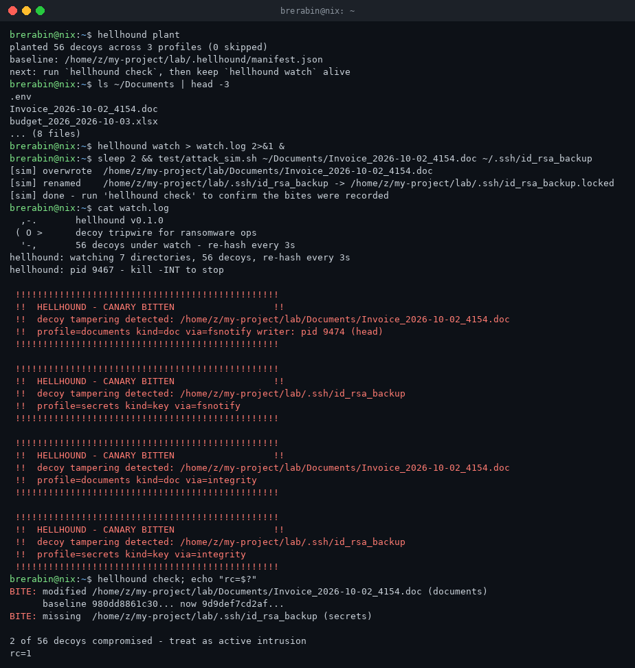

# hellhound

Canary tripwire for ransomware operations.

hellhound scatters decoy files across your filesystem — invoices, payroll
sheets, password vaults, wallet files, `.env`, SSH keys — and watches them.
Ransomware enumerates by name pattern and value priority, which makes decoys
the first thing it bites. The moment anything writes, renames or deletes one,
hellhound fires an alert and records who was holding the file open.

One static binary. No agent, no kernel module, no signature database.

```
$ hellhound plant
planted 24 decoys across 3 profiles (0 skipped)
baseline: /home/you/.hellhound/manifest.json

$ hellhound watch
  ,-.       hellhound v0.1.0
 ( O >      decoy tripwire for ransomware ops
  '-,       24 decoys under watch - re-hash every 30s

 !!!!!!!!!!!!!!!!!!!!!!!!!!!!!!!!!!!!!!!!!!!!!!!!
 !!  HELLHOUND - CANARY BITTEN
 !!  /home/you/Documents/Invoice_2026-10-03_4821.doc
 !!  profile=documents kind=doc via=fsnotify writer: pid 4471 (python3)
 !!!!!!!!!!!!!!!!!!!!!!!!!!!!!!!!!!!!!!!!!!!!!!!!
```



## why decoys work

Bulk encryption is loud but fast: most deployments finish before a human
reads any alert. Decoys invert the economics. A file that exists only to be
destroyed has a false-positive rate of zero — nothing legitimate writes to a
file you never use. Detection happens on the first touch, often seconds into
the run, while the operator is still mid-attack. This is the same primitive
behind canarytokens and commercial honeypot files; hellhound makes it a
self-hosted, dependency-free CLI you can run anywhere from a laptop to a
cron container.

## the two tripwires

1. **fsnotify on planted directories** — instant signal on write, create,
   rename or removal of any decoy.
2. **periodic SHA-256 re-hash of the manifest** — catches in-place edits,
   whole-tree deletions, and anything the watcher missed. Interval is
   configurable; `check` runs the same audit one-shot for cron.

Either one firing is an incident. There is no severity scaling: a touched
decoy means someone is walking your filesystem with intent.

## decoy classes

| class  | example name                     | what it mimics            |
|--------|----------------------------------|---------------------------|
| doc    | `Invoice_2026-09-28_2210.doc`    | OLE2 compound documents   |
| sheet  | `payroll_2026-10-01.xlsx`        | Excel workbook containers |
| db     | `users_prod_dump_3312.sql.db`    | SQLite databases          |
| wallet | `cold_storage.dat`               | crypto wallet stores      |
| kdbx   | `vault_1103.kdbx`                | KeePass databases         |
| env    | `.env`                           | deployed app secrets      |
| key    | `id_rsa_backup`                  | OpenSSH private keys      |
| seed   | `recovery_seed.txt`              | wallet recovery phrases   |

Every decoy embeds a unique attribution token. If data ever leaks — ransom
leak site, paste site, malware sample — the token ties it back to the exact
host and file that was hit.

## quickstart

```
go install github.com/brerabineth/hellhound@latest
hellhound init          # writes ~/.hellhound/hellhound.yaml
$EDITOR ~/.hellhound/hellhound.yaml
hellhound plant         # scatter decoys, record baseline
hellhound watch         # keep it running
```

Validate your deployment before you trust it:

```
hellhound status | awk '/doc|env/ {print $NF}'   # pick a decoy
test/attack_sim.sh ~/Documents/<decoy>           # safe, refuses system paths
hellhound check && echo clean || echo COMPROMISED
```

`check` exits 0 when every decoy is intact, 1 on any bite — wire it into
cron, CI, or a health endpoint.

## incident channels

| channel | default | notes                                        |
|---------|---------|----------------------------------------------|
| console | on      | loud stderr banner, writer pid when found    |
| jsonl   | on      | `~/.hellhound/incidents.jsonl`, machine-parsable |
| syslog  | off     | best effort via `/dev/log`                   |
| webhook | off     | POST the incident JSON to any URL            |

Incident schema: `time`, `source` (fsnotify/integrity), `path`, `profile`,
`kind`, `token`, `detail`, optional `pid` and `proc`.

## honest threat model

hellhound is a tripwire, not a vaccine. It will not stop encryption, it will
not recover data, and it is not a substitute for offline backups or an EDR.
What it buys you is early, unambiguous warning and a forensic breadcrumb —
at a cost of a few megabytes of disk and zero maintenance. Pair it with
immutable backups and an offline copy of everything you cannot lose.

Decoys are inert. They contain no code, no exploits, no tricks — random
bytes with the right names and signatures. If your security policy forbids
honeypots, this tool is not for you.

## build

```
make build       # linux/mac native
make cross       # linux/darwin/windows into dist/
make test
```

Go 1.23+. Runtime deps: none beyond fsnotify. See [docs/USAGE.md](docs/USAGE.md)
for the full manual, including systemd units and cron patterns.

## license

MIT. Use it on your own systems.
